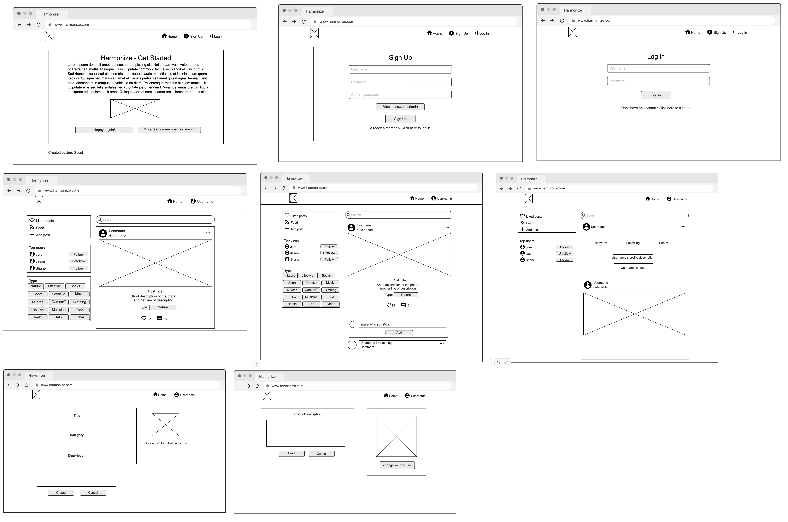
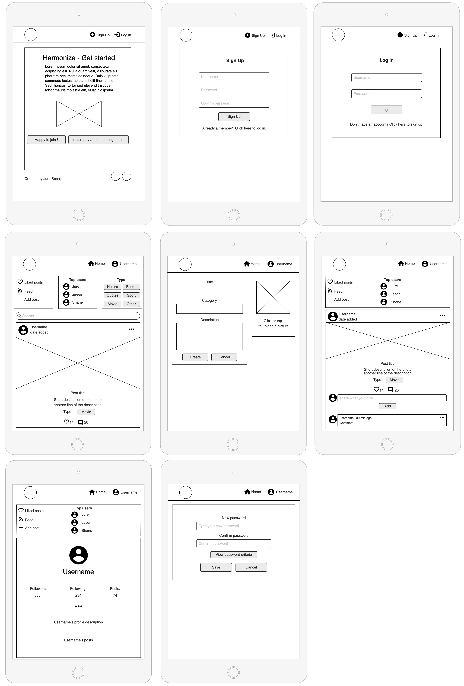
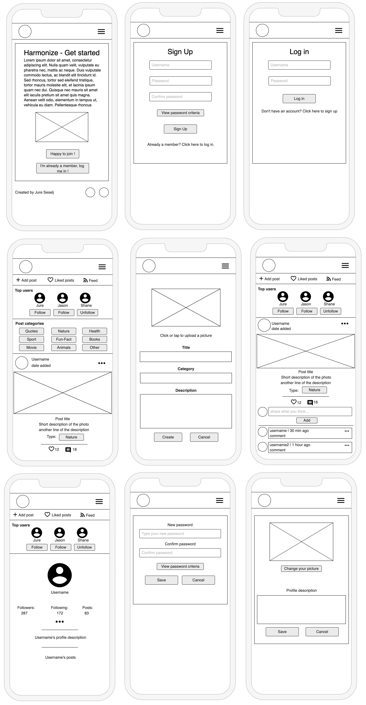

# Harmonize

# Goal for this Project

The goal for this project was to build a platform to enable users to interact with others in various ways such as commenting posts or following their profile.
The idea was to keep the portal very informal and for the entertainment purpose. Harmonize is a platform where users can share photos they made with the rest of the community. Everyone can like other users' pictures and share their opinion on a certain post. Users can also follow their favourite profiles and easily see updates on their activity. Harmonize is an app for all photo lovers who want to get inspired or share inspirations with others.

The key functionality aspects:
- Simple and intuitive navigation across all pages
- User authentication
- User interaction via posts, comments, likes, followers
- User profiles with their description and images
- CRUD functionality for posts, comments, likes, followers and profile information
- Posts filtering by title, author and category
- Posts filtering by liked posts and followed users posts
- Responsiveness to allow users use the app on various devices

[Live Project Here]()

# Table of Contents
- [Harmonize - Introduction](#harmonize)
    - [Goal for this Project](#goal-for-this-project)
    - [User Experience - UX](#user-experience---ux)
      - [User Stories](#user-stories)
    - [Design](#design)
      - [Colours](#colours)
      - [Typography](#typography)
      - [Imagery](#imagery)
      - [Wireframes](#wireframes)
    - [Technologies Used](#technologies-used)
      - [Languages](#languages)
      - [Libraries, frameworks and dependencies](#libraries-frameworks-and-dependencies)
      - [Tools & Programs](#tools--programs)
    - [Front-End](#front-end)
    - [Back-End API](#back-end-api)
## User Experience - UX

### User Stories

### First sprint

#### Navigation 

1. As a user, I can see the home page with explanation of the portal, so that I know what the app is about
2. As a user, I can see a navbar on every page, so that I can easily return to main page and access my profile page
3. As a logged-out user, I can see log in and sign up options so that I can log in or sign up
 
#### Authentication 

4. As a new user, I can create a new account so that I can access the app 
5. As a returning user, I can log in with my existing credentials so that I can access the app 
6. As a user, I can maintain my logged-in status until I choose to log out so that my use of app is not compromised 

### Second sprint

#### Posts 

7. As a user, I can create posts so that I can share my images with the community 
8. As a user, I can categorise my post so that other users can find it by its tag 
9. As a user, I can view other people’s posts so that I can get inspired by their images 
10.  As a user, I can view the details of a single post so that I can see its full description and other users comments 
11. As user, I can like a specific post so that I can show my interest 

#### The Post Page 

12. As a user, I can view the details of a single post so that I can read other users comments and know what they think about it
13. As a user, I can view a category for the post so that I know what the image is related to 
14. As user, I can add comments to a post so that I can share my thoughts about the post with the community 
15. As a user, I can see when the comments were created so that I know how old a comment is 
16. As an owner of a comment, I can edit my comment so that I can update my existing comment 
17. As an owner of a comment, I can delete my comment from the post 
18. As a post owner, I can edit my post title and description so that I can make corrections or update my post after it was created

### Third sprint

#### Main page 

19. As a user, I can view posts ordered by most recently added so that I am up to date with the newest content 
20. As a user, I can keep scrolling through the posts so that they are loaded automatically and I don't have to select the next page 
21. As a user, I can see the posts I liked so that I can find the posts I enjoy the most
22. As a user, I can view posts from users I followed, so I can follow their activity
23. As a user, I can view posts category tags, so that I choose posts to display that I’m particularly interested in
24. As a user, I can search for posts with keywords so that I can find the posts I am interested in 

#### User Profile Page 

25. As a user, I can add my profile avatar so that other users can easily identify me 
26. As a user, I can view user's avatars so that I can easily identify other users of the app 
27. As a user, I can update the picture and description of my profile on the profile page so that other users view up to date info about me 
28. As a user, I can change password to my account so that I can keep my profile secure 

### Fourth sprint

#### Other Users Profiles 

29. As a user, I can view all the posts by a specific user so that I can see their latest activity 
30. As a user, I can view other users’ profiles with their profile description, number of posts, followers and users followed so that I can learn more about them 
31. As a user, I can follow and unfollow other users so that I can get specific users’ posts in my posts feed 
32. As a user, I can see a list of the most followed profiles so that I can see which profiles are popular 

#### General

33. As a site owner I want my site to be fully responsive so that users can you use it on different devices
34. As a site owner, I want users to come to a 404 error page so that they don't have to user the browser back button if they enter a URL that does not exist
35. As a site user, I can view feedback messages, so that I know if my comment/profile/post has been updated

[Back to Top](#table-of-contents)

## Design

#### Colours

* The colour scheme for this application was the aim to keep the colours neutral and warm to create a calming feeling and gather user's focus on the photographs without distraction by other graphics on the website. 

#### Typography

* Google Fonts were implemented on the website. Prompt with sans-serif as fallback was used thoughout the site to ensure high legibility of the content.
Prompt features a tall x-height to aid in readability of mixed-case and lower-case text.

#### Imagery

* All the imagery is related to the website:

- 404 picture were taken from [here](https://pixabay.com/illustrations/error-404-web-developers-error-site-6052476/)
- No results found picture taken from [here](https://pngtree.com/freepng/no-result-search-icon_6511543.html)
- Image on comments page were taken from [here](https://www.freepik.com/free-vector/illustration-speech-bubble_2606145.htm#query=chat&position=17&from_view=search)
- The lading page image comes from [here](https://depositphotos.com/home.html)
- Site logo was created with [favicon.io](https://favicon.io/favicon-generator/)
- Upload image icon taken from [here](https://pngtree.com/freepng/image-upload-icon-photo-upload-icon_5279795.html)

### Wireframes

* Wireframes for this project can be located below:

Big screens - laptop & desktop

Medium screens - tablet

Small screens - mobile

## Technologies Used

### Languages

- HTML
- CSS
- Javascript
  - React (18.2.0)

### Libraries, frameworks and dependencies

- [Axios](https://axios-http.com/docs/intro) - axios were used for promise-based HTTP. Justification: I used axios to send API requests from the React project to the API and avoid any CORS errors when sending cookies.
- [ClassNames](https://www.npmjs.com/package/classnames/) - JavaScript utility for conditionally joining classNames together, used in the FeedbackMsg component. Justification: I used it to apply the styles dynamically based on the type of style and apply more than one style to elements in FeedbackMsg component
- [JWT](https://jwt.io/) - library to decode out JSON Web token. Justification: I used JWT to prevent unauthenticated user from making extra network requests to refresh their access token. Also used to remove the timestamp from the browser when the user refreshes token expires or the user logs out.
- [Popper](https://popper.js.org/) - a 3rd party library used by React-Bootstrap. Justification: I used Popper to make sure the dropdown menus position is fixed on all browsers.
- [React 18](https://18.reactjs.org/) - JavaScript library for building user interfaces
- [React-Bootstrap 4.6](https://react-bootstrap-v4.netlify.app/) - Justification: I used Bootstrap React library for UI components, styling and responsiveness.
- [React Infinite Scroll](https://www.npmjs.com/package/react-infinite-scroll-component) - Justification: I used this component to load content (posts/comments) automatically as the user scrolls towards the bottom of the page without having to jump to next/previous page.
- [React Router](https://v5.reactrouter.com/web/guides/quick-start) - used for dynamic routing. Justification: I used this library to enable the navigation among views of various components and control what the user sees depending on the URL they have accessed in the browser.

### Tools & Programs

- [Am I Responsive](http://ami.responsivedesign.is/) was used to create the multi-device mock-up at the top of this README.md file
- [Balsamiq](https://balsamiq.com/) to create the projects wireframes
- [Chrome dev tools](https://developers.google.com/web/tools/chrome-devtools/) was used for debugging of the code and checking site for responsiveness
- [Cloudinary](https://cloudinary.com/) to store static files
- [Coolors](https://coolors.co/?home) was used to create the color scheme palette
- [Favicon.io](https://favicon.io) for making the site logo and favicon
- [Font Awesome](https://fontawesome.com/) - Icons from Font Awesome were used throughout the site
- [Google Fonts](https://fonts.google.com/) - import of Inter font
- [Git](https://git-scm.com/) was used for version control within VSCode to push the code to GitHub
- [GitHub](https://github.com/) was used as a remote repository to store project code
- [Gitpod](https://gitpod.io) was used to host a virtual workspace
- [Heroku](https://www.heroku.com/) was used to deploy the project into live environment
- [Remove.bg](https://www.remove.bg/) was used to remove background on app images
- [Unscreen](https://www.unscreen.com/upload) - remove white background from the loading gif (spinner)
- Validation:
  - [WC3 Validator](https://validator.w3.org/) was used to validate the html
  - [Jigsaw W3 Validator](https://jigsaw.w3.org/css-validator/) was used to validate the css
  - [ESLint](https://eslint.org/) used to validate JSX code
  - [Lighthouse](https://developers.google.com/web/tools/lighthouse/) used to validate performance, accessibility, best practice and SEO of the app
  - [Wave](https://wave.webaim.org/) - used to evaluate application accessibility

[Back to Top](#table-of-contents)

## Front-End

### React

React is a declarative, efficient, and flexible JavaScript library for building user interfaces. Its primary goal is to make it easy to reason about an interface and its state at any point in time, by dividing the UI into a collection of independent and reusable components ([source](https://www.freecodecamp.org/news/the-react-handbook-b71c27b0a795/)).

I used React for this application for several reasons:
- Speed - applying React significantly increases the page loading speed and reducing the wait, which affects user experience and satisfaction
- Flexibility - the React code is easier to maintain and is flexible due to its modular structure, compared to other front-end frameworks
- React Bootstrap - excellent choice for improving user experience, used for styling and responsiveness. It comes with ready-to-use React built components. They are implemented with accessibility in mind, which is a vital factor when creating a front-end application. I used plain Bootstrap in my previous projects, so it was an easy choice to use React Bootstrap in this app.
- Most used library for developing social networking and media content applications - e.g. Meta (formerly Facebook), Instagram, Netflix, Airbnb, etc.
- Reusability of components - no need to write various codes for the same features

## Back-End API

### Django REST Framework

The API for this Front-End application was built with the Django REST Framework. The repository with a README file for the DRF Back-End can be found [here](https://github.com/JureSeselj/harmonize-drf-api)