# Harmonize

# Goal for this Project

The goal for this project was to build a platform to enable users to interact with others in various ways such as commenting posts or following their profile.
The idea was to keep the portal very informal and for the entertainment purpose. Harmonize is a platform where users can share photos they made with the rest of the community. Everyone can like other users' pictures and share their opinion on a certain post. Users can also follow their favourite profiles and easily see updates on their activity. Harmonize is an app for all photo lovers who want to get inspired or share inspirations with others.

The key functionality aspects:
- Simple and intuitive navigation across all pages
- User authentication
- User interaction via posts, comments, likes, followers
- User profiles with their description and images
- CRUD functionality for posts, comments, likes, followers and profile information
- Posts filtering by title, author and category
- Posts filtering by liked posts and followed users posts
- Responsiveness to allow users use the app on various devices

[Live Project Here]()

# Table of Contents
- [Harmonize - Introduction](#harmonize)
    - [Goal for this Project](#goal-for-this-project)
    - [User Experience - UX](#user-experience---ux)
      - [User Stories](#user-stories)
    - [Design](#design)
      - [Colours](#colours)
      - [Typography](#typography)
      - [Imagery](#imagery)
      - [Wireframes](#wireframes)
    - [Technologies Used](#technologies-used)
      - [Languages](#languages)
      - [Libraries, frameworks and dependencies](#libraries-frameworks-and-dependencies)
      - [Tools & Programs](#tools--programs)
    - [Front-End](#front-end)
    - [Back-End API](#back-end-api)
    - [Features](#features)
    - [Future features / improvements](#future-features--improvements)
## User Experience - UX

### User Stories

### First sprint

#### Navigation 

1. As a user, I can see the home page with explanation of the portal, so that I know what the app is about
2. As a user, I can see a navbar on every page, so that I can easily return to main page and access my profile page
3. As a logged-out user, I can see log in and sign up options so that I can log in or sign up
 
#### Authentication 

4. As a new user, I can create a new account so that I can access the app 
5. As a returning user, I can log in with my existing credentials so that I can access the app 
6. As a user, I can maintain my logged-in status until I choose to log out so that my use of app is not compromised 

### Second sprint

#### Posts 

7. As a user, I can create posts so that I can share my images with the community 
8. As a user, I can categorise my post so that other users can find it by its tag 
9. As a user, I can view other people’s posts so that I can get inspired by their images 
10.  As a user, I can view the details of a single post so that I can see its full description and other users comments 
11. As user, I can like a specific post so that I can show my interest 

#### The Post Page 

12. As a user, I can view the details of a single post so that I can read other users comments and know what they think about it
13. As a user, I can view a category for the post so that I know what the image is related to 
14. As user, I can add comments to a post so that I can share my thoughts about the post with the community 
15. As a user, I can see when the comments were created so that I know how old a comment is 
16. As an owner of a comment, I can edit my comment so that I can update my existing comment 
17. As an owner of a comment, I can delete my comment from the post 
18. As a post owner, I can edit my post title and description so that I can make corrections or update my post after it was created

### Third sprint

#### Main page 

19. As a user, I can view posts ordered by most recently added so that I am up to date with the newest content 
20. As a user, I can keep scrolling through the posts so that they are loaded automatically and I don't have to select the next page 
21. As a user, I can see the posts I liked so that I can find the posts I enjoy the most
22. As a user, I can view posts from users I followed, so I can follow their activity
23. As a user, I can view posts category tags, so that I choose posts to display that I’m particularly interested in
24. As a user, I can search for posts with keywords so that I can find the posts I am interested in 

#### User Profile Page 

25. As a user, I can add my profile avatar so that other users can easily identify me 
26. As a user, I can view user's avatars so that I can easily identify other users of the app 
27. As a user, I can update the picture and description of my profile on the profile page so that other users view up to date info about me 
28. As a user, I can change password to my account so that I can keep my profile secure 

### Fourth sprint

#### Other Users Profiles 

29. As a user, I can view all the posts by a specific user so that I can see their latest activity 
30. As a user, I can view other users’ profiles with their profile description, number of posts, followers and users followed so that I can learn more about them 
31. As a user, I can follow and unfollow other users so that I can get specific users’ posts in my posts feed 
32. As a user, I can see a list of the most followed profiles so that I can see which profiles are popular 

#### General

33. As a site owner I want my site to be fully responsive so that users can you use it on different devices
34. As a site owner, I want users to come to a 404 error page so that they don't have to user the browser back button if they enter a URL that does not exist
35. As a site user, I can view feedback messages, so that I know if my comment/profile/post has been updated

[Back to Top](#table-of-contents)

## Design

#### Colours

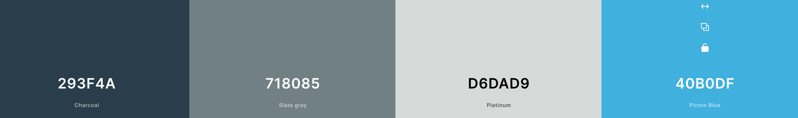

* The colour scheme for this application was the aim to keep the colours neutral and warm to create a calming feeling and gather user's focus on the photographs without distraction by other graphics on the website. 

#### Typography

* Google Fonts were implemented on the website. Prompt with sans-serif as fallback was used thoughout the site to ensure high legibility of the content.
Prompt features a tall x-height to aid in readability of mixed-case and lower-case text.

#### Imagery

* All the imagery is related to the website:

- 404 picture were taken from [here](https://pixabay.com/illustrations/error-404-web-developers-error-site-6052476/)
- No results found picture taken from [here](https://pngtree.com/freepng/no-result-search-icon_6511543.html)
- Image on comments page were taken from [here](https://www.freepik.com/free-vector/illustration-speech-bubble_2606145.htm#query=chat&position=17&from_view=search)
- The lading page image comes from [here](https://depositphotos.com/home.html)
- Site logo was created with [favicon.io](https://favicon.io/favicon-generator/)
- Upload image icon taken from [here](https://pngtree.com/freepng/image-upload-icon-photo-upload-icon_5279795.html)

### Wireframes

* Wireframes for this project can be located below:

Big screens - laptop & desktop

Medium screens - tablet

Small screens - mobile

## Technologies Used

### Languages

- HTML
- CSS
- Javascript
  - React (17.0.2)

### Libraries, frameworks and dependencies

- [Axios](https://axios-http.com/docs/intro) - axios were used for promise-based HTTP. Justification: I used axios to send API requests from the React project to the API and avoid any CORS errors when sending cookies.
- [ClassNames](https://www.npmjs.com/package/classnames/) - JavaScript utility for conditionally joining classNames together, used in the FeedbackMsg component. Justification: I used it to apply the styles dynamically based on the type of style and apply more than one style to elements in FeedbackMsg component
- [JWT](https://jwt.io/) - library to decode out JSON Web token. Justification: I used JWT to prevent unauthenticated user from making extra network requests to refresh their access token. Also used to remove the timestamp from the browser when the user refreshes token expires or the user logs out.
- [Popper](https://popper.js.org/) - a 3rd party library used by React-Bootstrap. Justification: I used Popper to make sure the dropdown menus position is fixed on all browsers.
- [React 18](https://18.reactjs.org/) - JavaScript library for building user interfaces
- [React-Bootstrap 4.6](https://react-bootstrap-v4.netlify.app/) - Justification: I used Bootstrap React library for UI components, styling and responsiveness.
- [React Infinite Scroll](https://www.npmjs.com/package/react-infinite-scroll-component) - Justification: I used this component to load content (posts/comments) automatically as the user scrolls towards the bottom of the page without having to jump to next/previous page.
- [React Router](https://v5.reactrouter.com/web/guides/quick-start) - used for dynamic routing. Justification: I used this library to enable the navigation among views of various components and control what the user sees depending on the URL they have accessed in the browser.

### Tools & Programs

- [Am I Responsive](http://ami.responsivedesign.is/) was used to create the multi-device mock-up at the top of this README.md file
- [Balsamiq](https://balsamiq.com/) to create the projects wireframes
- [Chrome dev tools](https://developers.google.com/web/tools/chrome-devtools/) was used for debugging of the code and checking site for responsiveness
- [Cloudinary](https://cloudinary.com/) to store static files
- [Coolors](https://coolors.co/?home) was used to create the color scheme palette
- [Favicon.io](https://favicon.io) for making the site logo and favicon
- [Font Awesome](https://fontawesome.com/) - Icons from Font Awesome were used throughout the site
- [Google Fonts](https://fonts.google.com/) - import of Inter font
- [Git](https://git-scm.com/) was used for version control within VSCode to push the code to GitHub
- [GitHub](https://github.com/) was used as a remote repository to store project code
- [Gitpod](https://gitpod.io) was used to host a virtual workspace
- [Heroku](https://www.heroku.com/) was used to deploy the project into live environment
- [Remove.bg](https://www.remove.bg/) was used to remove background on app images
- [Unscreen](https://www.unscreen.com/upload) - remove white background from the loading gif (spinner)
- Validation:
  - [WC3 Validator](https://validator.w3.org/) was used to validate the html
  - [Jigsaw W3 Validator](https://jigsaw.w3.org/css-validator/) was used to validate the css
  - [ESLint](https://eslint.org/) used to validate JSX code
  - [Lighthouse](https://developers.google.com/web/tools/lighthouse/) used to validate performance, accessibility, best practice and SEO of the app
  - [Wave](https://wave.webaim.org/) - used to evaluate application accessibility

[Back to Top](#table-of-contents)

## Front-End

### React

React is a declarative, efficient, and flexible JavaScript library for building user interfaces. Its primary goal is to make it easy to reason about an interface and its state at any point in time, by dividing the UI into a collection of independent and reusable components ([source](https://www.freecodecamp.org/news/the-react-handbook-b71c27b0a795/)).

I used React for this application for several reasons:
- Speed - applying React significantly increases the page loading speed and reducing the wait, which affects user experience and satisfaction
- Flexibility - the React code is easier to maintain and is flexible due to its modular structure, compared to other front-end frameworks
- React Bootstrap - excellent choice for improving user experience, used for styling and responsiveness. It comes with ready-to-use React built components. They are implemented with accessibility in mind, which is a vital factor when creating a front-end application. I used plain Bootstrap in my previous projects, so it was an easy choice to use React Bootstrap in this app.
- Most used library for developing social networking and media content applications - e.g. Meta (formerly Facebook), Instagram, Netflix, Airbnb, etc.
- Reusability of components - no need to write various codes for the same features

There were various components created and reused across this application.

- `<Asset />` - multipurpose reusable compontent which displays different versions of the component depending on the props we pass to it:
  - loading gif (spinner) when content is being loaded
  - image with src and alt attribute
  - paragraph with a message

- `<Avatar />` - resuable component, used to render profile images in the UI. Passed props allow for setting image source and size and adjust image dimensions depending on where the component is rendered. Example of use include the `<NavBar />` component, Post page or the Profile page. On mobile screens Avatar component within the Profile Page will be significantly bigger than on other screen sizes.

- `<DropdownMenu />` - reusable component, used to render the dropdown menu which allows user to edit or delete their own posts or comments, and also edit their profile or change profile password.

- `<FeedbackMsg />` - component for displaying feedback messages to the user upon editing/deleting comments, deleting post, updating profile information or a password.

- `<Landing />` - specific component for displaying a landing page for new / not logged-in users, which contains links to sign up and log in, in addition to the navbar.

- `<LikeFeedAddPost />` - reusable component containing 3 icons to add a post, show liked post or show posts by profiles the users follows. Displayed on various pages of the app.

- `<NavBar />` - reusable component with the content depending on the login status of the user. For logged in user it shows icon link to the main posts page and user avatar/picture. For those who are not logged in, it displays icon links to sign up or log in instead of the avatar. The component is used on each page of the app.

- `<PageNotFound />` - specific component for displaying a 404 graphic error message with a return to menu button when user enters the url which does not exist.

- `<PasswordCriteria />` - reusable component containing password criteria which are displayed on button hover or focus. Used on sign up page and profile password change page.

- `<PopularProfiles />` - reusable component showing first three most followed profiles in the app. The component displays user avatar, name and follow/unfollow button. These buttons are hidden on medium screen size devices. The component is used across the app together with the `<LikeFeedAddPost />` component and post categories badges on relevant pages.

## Back-End API

### Django REST Framework

The API for this Front-End application was built with the Django REST Framework. The repository with a README file for the DRF Back-End can be found [here](https://github.com/JureSeselj/harmonize-drf-api)

[Back to Top](#table-of-contents)
## Features

### Landing page
- Includes navbar, main body and a footer
- Lading page main body includes explanation what the app is about
- Contains direct links to sign-up and log-in pages

See feature screenshot

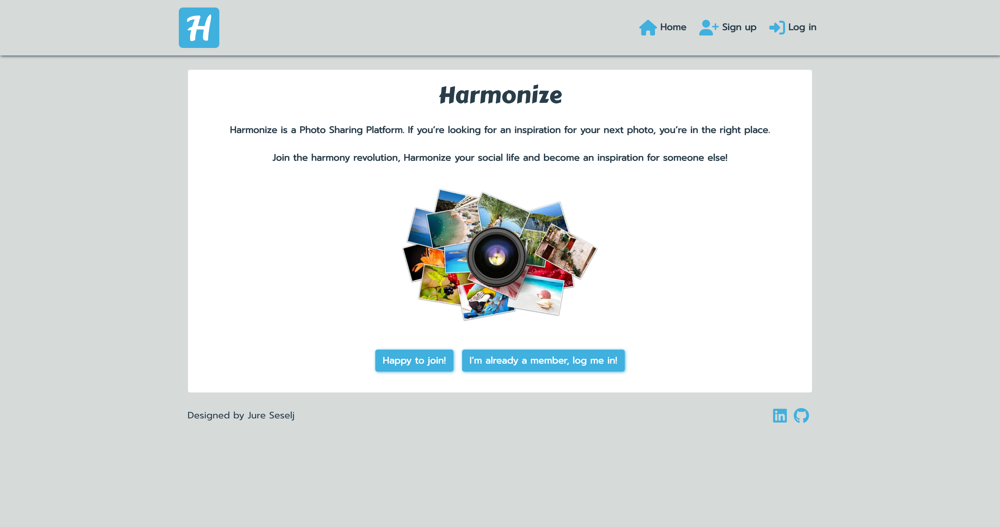

### Navigation Bar and Logo
- Featured and consistent on the all pages
- Two variants of the navbar:
  - New or not logged-in users will see the Home, Sign up & Log in icons - options to either register or log in
  - Logged-in users will see the Home icon and their user avatar & name with option on click to either view their profile or log out
- The nav bar is fully responsive and changes to a toggler (hamburger menu) on smaller size screens

See feature screenshots

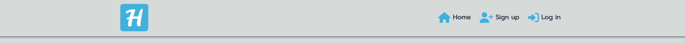
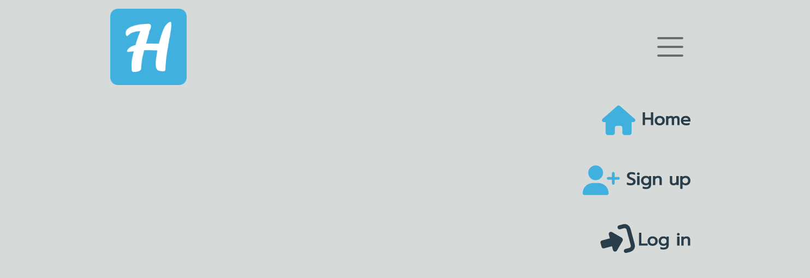
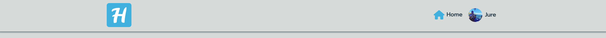
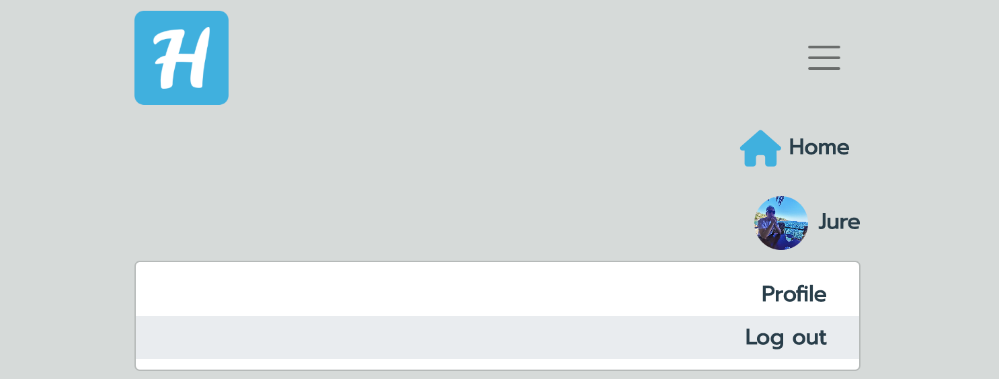

### Footer
- A footer is displayed at the bottom of the landing page
- Contains copyrights info
- Contains links to LinkedIn social media and GitHub pages (opening in a separate window)

See feature screenshot

### Sign up form
- New users can create an account
- The user must provide a valid username (between 1-10 characters long), password and password confirmation
- Password must meet certain criteria which user can see on hovering/taping the ‘view password criteria’ button
- User cannot register the same details twice for an account
- Once registered, the user is redirected to the login page to log in

See feature screenshots

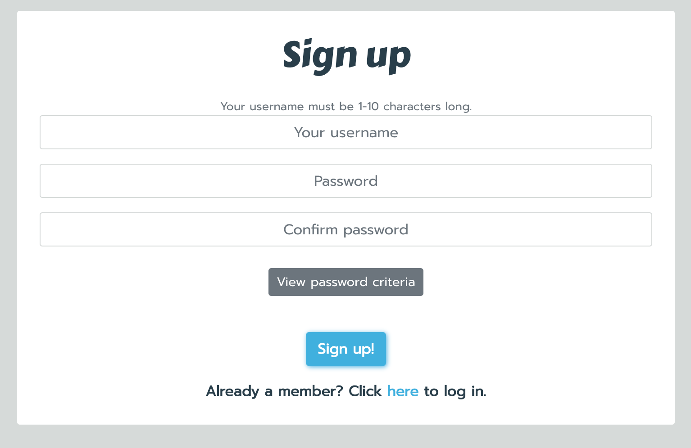
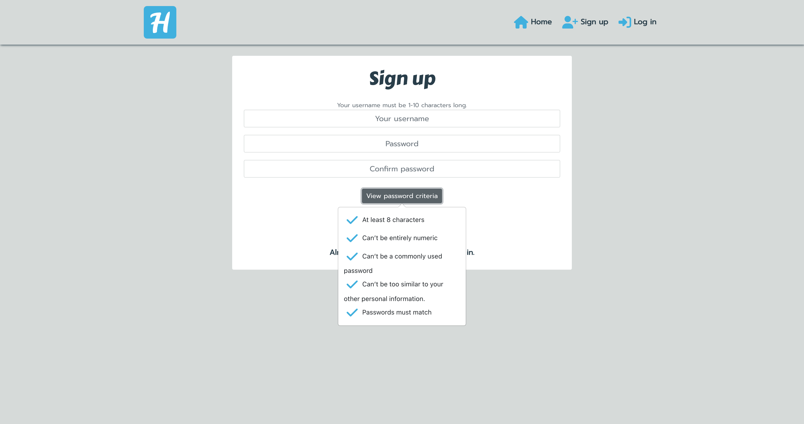

### Login form
- Returning users can login to their account
- The user must have an account in the system and they must enter the correct username and password
- Both fields are mandatory
- Once logged in the user will be navigated to the main posts page
- Warning message is displayed on incorrect input

See feature screenshot

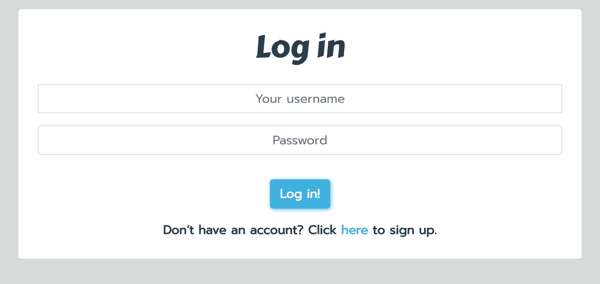

### Post create/update form
- Contains image, title, category and description
- Description field is optional
- Allows user to share their pictures with others
- Allows user to categorise their post to make it easy to be found by other users

See feature screenshots

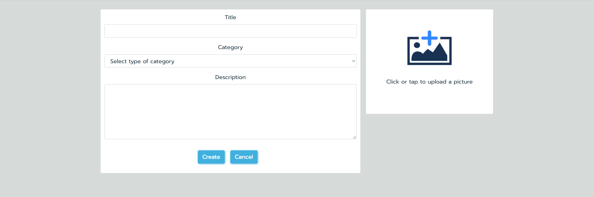

### Main posts page
- Main posts page is displayed for logged-in users instead of the landing page
- Contains 3 small menus:
  - Add, likes & feed
  - Top Users
  - Post category badges
- Contain search bar above all posts
- Without any applied search filter displays posts added by all users
- Display all posts ordered by the most recent one

See feature screenshots

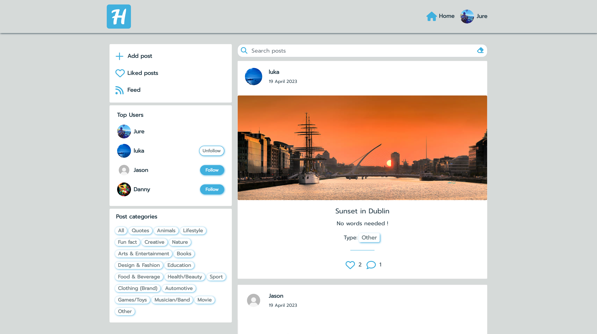

### Post page
- Contains details of a single post - image, title, description (if provided by the user) and its category tag
- Contains number of likes and comments the post has
- Contains like icon to allow user to like the post
- Features comments section below the post

See feature screenshots

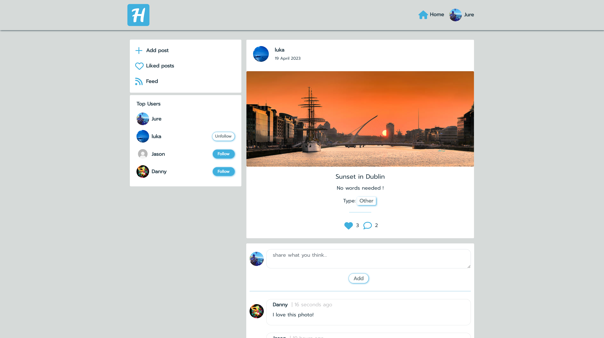

### Comments
- Enable users to share their opinion on a specific post
- Display passed time since adding the post (e.g. 4 minutes ago)
- Users have an option to update or delete the comment

See feature screenshots

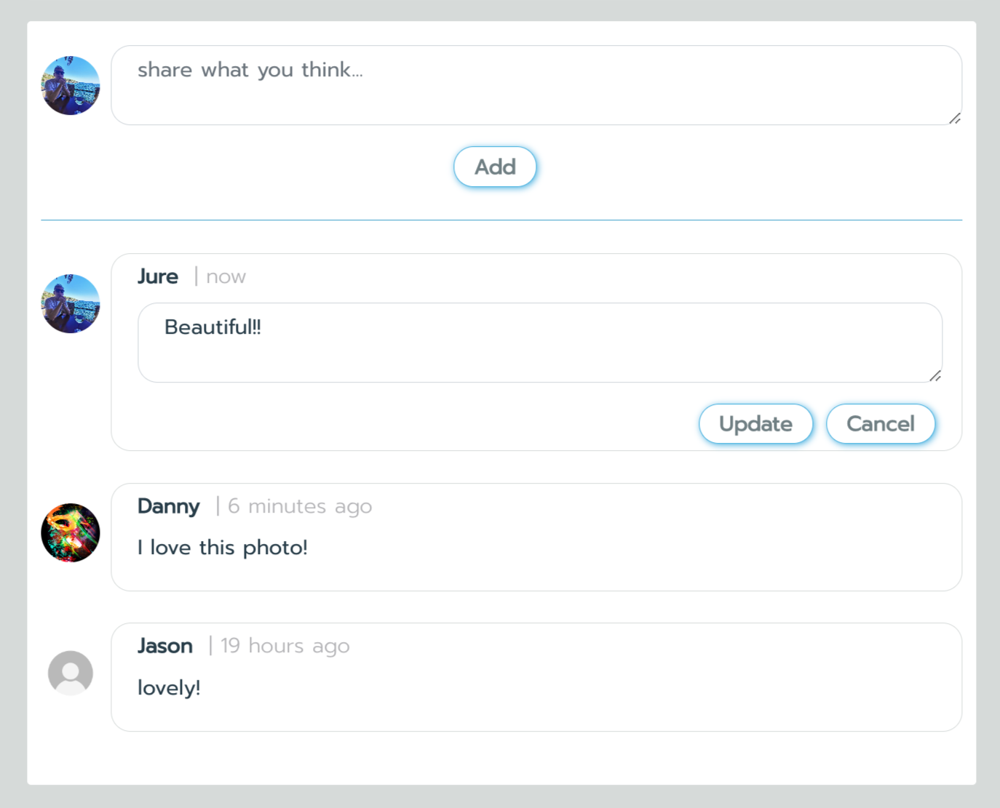

### Likes
- Allow user to express their interest in the post
- Like icons is marked green if user likes the post
- User cannot like their own posts
- Allow user to narrow their search to liked posts only when clicked on the ‘Feed’ option in the small menu

See feature screenshots

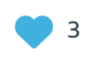
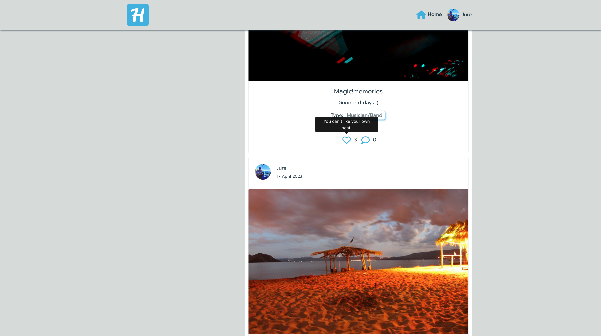

### Profile page
- Contains information about the user
- Displays info how many posts and followers user has and how many users they are following
- Displays profile information if it was provided by the profile owner
- Contains a dropdown menu to edit the profile and change profile password

See feature screenshots

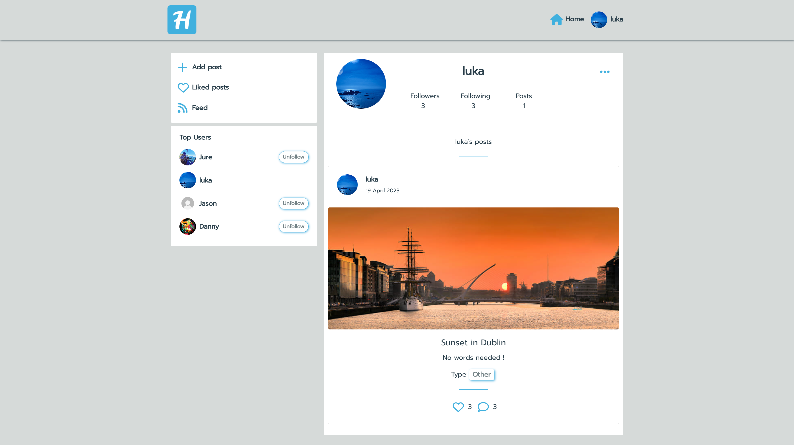

### Profile avatar
- Allow users to change their default avatar to their own avatar or picture
- Displayed in the navbar, at top of the post, within profile page and by user comment
- Displayed within ’Top Users’ menu

See feature screenshots

### Password change form
- Allows user to change their profile password
- Contains password criteria visible on hover/tap of ‘view password criteria’ button

See feature screenshots

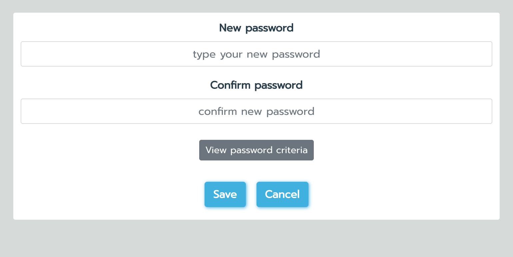
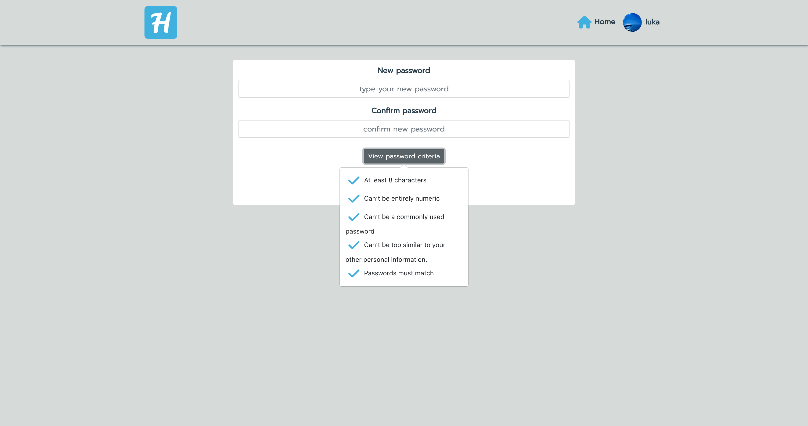

### Infinite scroll
- Allows user to scroll through the content without having to select the next/previous page
- Used for the posts and comments
- Improves general user experience and user engagement
- Displays the loading spinner before loading

See feature screenshots

### Follow/unfollow
- Users are able to follow a specific profile they like and then be able to easily view their posts in the Feed

See feature screenshots

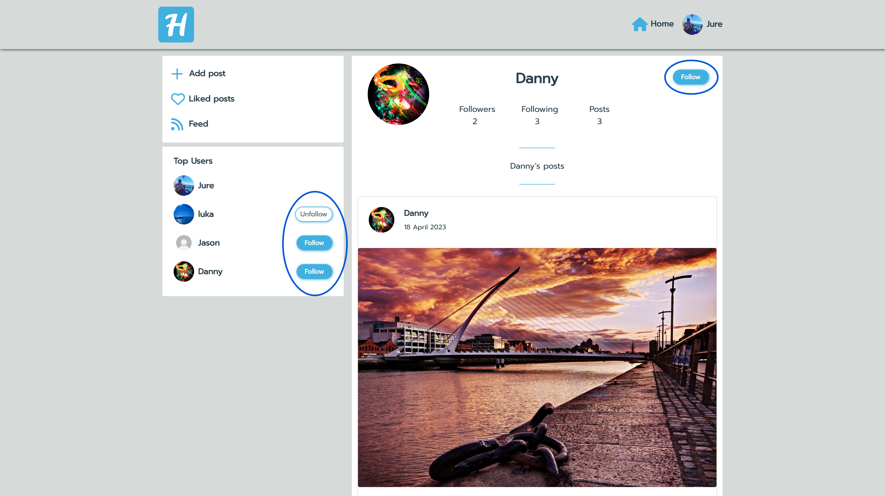

### ‘Add, liked, feed’ menu
- Allow user to create a post
- Featured on every page (except for the create/update post/profile or change password)
- Allow user to view only posts they liked
- Allow user to view only posts created by users they follow

See feature screenshots

### Top Users menu
- Displays three most followed users in the app
- Contains follow buttons next to username which allow following these users
- Featured on the majority of pages (except for edit post/profile or change password)

See feature screenshots

### Category badges
- Allow to tag the post by the type of the photo
- Allow other users to find content they are most interested in

See feature screenshots

### Search bar
- By typing a phrase in the search bar users can find a specific post or a user they are looking for
- Allows to search through all post title, users or post category
- Allows search through liked posts only or posts by users followed
- User can click on the eraser icon to clear the search content instead of hitting the backspace button

See feature screenshots

### 404 error page
- Displays if the user enters a URL that does not exist
- Contains a button to redirect user to the main page 

See feature screenshots

### Feedback messages
- User is provided with feedback message about the action their performed such as edited/deleted comment, updated profile or password, deleted a post

See feature screenshots

[Back to Top](#table-of-contents)
## Future features / improvements

Example of potential improvements to this project:

- Authentication
  - Allow user sign up to the app using email or require email input for registration
  - Forgotten password option to recover access to the account via email
  - Allow user authentication with already existing accounts, e.g. Google, Facebook etc. 
- Profile
  - Option to send a message to other user
- Posts
  - Additional field to include the recipe of the dish
  - Show most liked posts in the app - similar to ‘Top Users’ menu
- Comments
  - Option to reply to a selected comment and create a conversation
  - Option to like/unlike other users’ comments

I was initially planning to have the functionality to delete user account but I decided to keep all the signed-up users within the database and do not allow them to remove their profile.